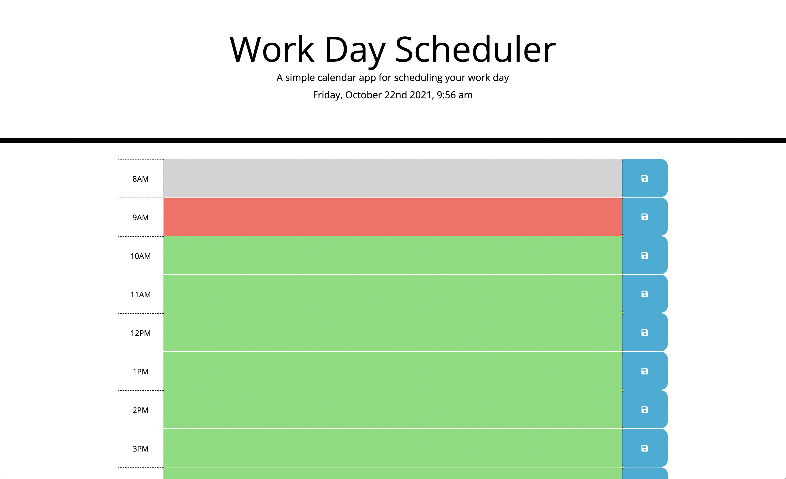
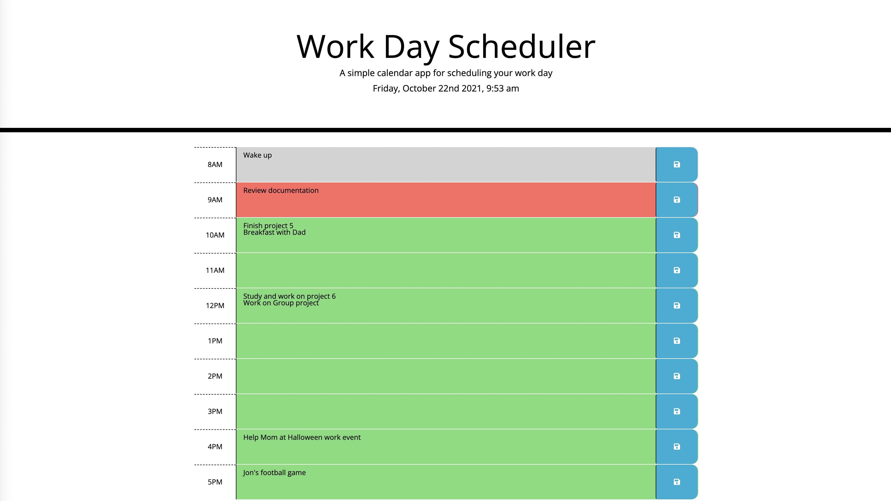
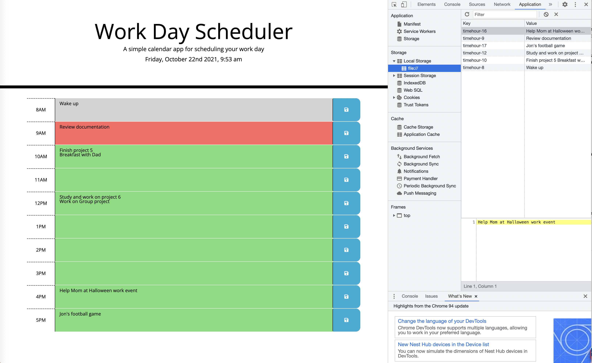

# Calendar Workday Scheduler

## Application Description
This is a simple weekday planner application that presents a daily hour schedule for an average workday (running from 8am to 5pm). It provides the user with several time-blocks that, if clicked, can turn into a text area, and the user is allowed to type and enter their intended to-do task for their particular event to be completed by that time. The user then saves their event with the saved button which is kept in the user's browser and stays there even when the page is refreshed or not accessed until the next day. With the average workday time taken from the user's local time, specific hours can present itself as being in the past (displayed as a grey colored time-block), present (displayed as a red colored time-block), and future (displayed as a green colored time-block). This is presented in order for the user to understand when their task was expected to be done previously ("past"), now ("present"), and in the later hours of their workday ("future").

## Application developed with
* HTML
* JavaScript
* CSS
* jQuery – used to establish formatted Moment.js date, save button element, local storage that saves the user's task, and alongside Day.js, has function retrieve time status of the time blocks with their time status
* Bootstrap - used for the site's main design and implements mobile responsive design to be used on mobile or desktop
* Day.js - used in the function that retrieves the current hour, saved time format, and worked in the presentation of the time blocks 
* Moment.js - used to show the formatted date and time below the header
* Overall use of Web APIs to identify function errors and ensure the workday scheduler was working correctly.

## Links to Repository and Website
* GitHub Repository: https://github.com/trujilml/calendar-workday-scheduler 
* Deployed Link: https://trujilml.github.io/calendar-workday-scheduler/ 

## Screenshots
First screenshot demonstrates a blank workday schedule showing all the time-blocks with their different colored formats while the second and third screenshot presents the multiple tasks on the planner and that have been saved on the user's local storage.
 
 
 